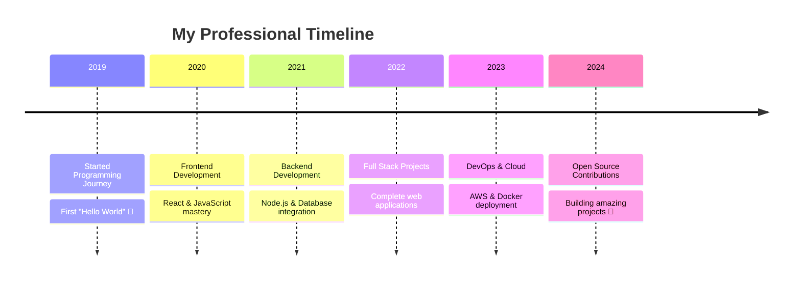

## Hi there 👋

<!--
**Ashish-1910/Ashish-1910** is a ✨ _special_ ✨ repository because its `README.md` (this file) appears on your GitHub profile.

Here are some ideas to get you started:

- 🔭 I’m currently working on ...
- 🌱 I’m currently learning ...
- 👯 I’m looking to collaborate on ...
- 🤔 I’m looking for help with ...
- 💬 Ask me about ...
- 📫 How to reach me: ...
- 😄 Pronouns: ...
- ⚡ Fun fact: ...
# 👋 Hi there, I'm Ashish!

<div align="center">
  
  
  
  [](https://github.com/Ashish-1910)
  
</div>

---

## 🚀 About Me

```typescript
const ashish = {
    name: "Ashish",
    username: "Ashish-1910", 
    location: "India 🇮🇳",
    role: "Full Stack Developer",
    passion: ["AI & Machine Learning", "Web Development", "Problem Solving"],
    currentFocus: "Building innovative solutions with modern technologies",
    funFact: "I believe in merging creativity with algorithms! ✨",
    workingOn: "Exciting new projects...",
    learning: "Advanced AI techniques and cloud technologies",
    collaboration: "Open source projects and innovative ideas",
    askMeAbout: ["JavaScript", "Python", "React", "Node.js", "AI/ML"],
    reachMe: "Always open to interesting conversations!"
};
```

---

## 🛠️ Tech Stack & Skills

<div align="center">

### 💻 Programming Languages


### 🌐 Frontend Development


### 🔧 Backend Development


### 🗄️ Databases


### 🤖 AI & Machine Learning


### ☁️ Cloud & DevOps


</div>

---

## 📊 GitHub Statistics

<div align="center">
<div align="center">
  
</div>

<div align="center">
  
</div>

---

## 🚀 **About Me**

🥑 **[Your Current Role/Title]** | 🌱 **Passionate Developer & Innovator**

I'm a passionate **[Your Profession/Specialization]** with expertise in **[Your Main Technologies]**. I love creating innovative solutions, contributing to open-source projects, and sharing knowledge with the developer community.

- 🔭 Currently working on **[Your Current Project/Company]**
- 🌱 Learning **[Technologies you're currently learning]**
- 👯 Looking to collaborate on **[Types of projects you want to collaborate on]**
- 🤔 Seeking help with **[Areas where you'd like assistance]**
- 💬 Ask me about **[Your areas of expertise]**
- 📫 How to reach me: **[Your preferred contact method]**
- ⚡ Fun fact: **[An interesting fact about you]**

---

## 🛠️ **Tech Stack & Skills**

<div align="center">

### **Programming Languages**


### **Frontend Development**


### **Backend Development**


### **Databases**


### **Cloud & DevOps**


### **Tools & Technologies**


</div>

---

## 📊 **GitHub Statistics**

<div align="center">
  
  
</div>

<div align="center">
  
</div>

<div align="center">
  
</div>

---

## 🎯 **Featured Projects**

<div align="center">

### 🌟 **Project Showcase**

[](https://github.com/Ashish-1910/project-name-1)
[](https://github.com/Ashish-1910/project-name-2)

</div>

### 🚀 **Notable Projects**

| Project | Description | Tech Stack | Demo |
|---------|-------------|------------|------|
| 🎮 **[Project Name 1]** | Brief description of your amazing project | `React` `Node.js` `MongoDB` | [🔗 Live Demo](#) |
| 📱 **[Project Name 2]** | Another cool project you've built | `Python` `Django` `PostgreSQL` | [🔗 Live Demo](#) |
| 🤖 **[Project Name 3]** | AI/ML project description | `Python` `TensorFlow` `FastAPI` | [🔗 Live Demo](#) |
| 🌐 **[Project Name 4]** | Web application project | `Vue.js` `Express.js` `MySQL` | [🔗 Live Demo](#) |

---

## 📈 **Professional Journey**



---

## 🏆 **Achievements & Certifications**

<div align="center">


</div>

### 🎖️ **Certifications**
- 🏅 **[Certification Name 1]** - [Issuing Organization]
- 🏅 **[Certification Name 2]** - [Issuing Organization]
- 🏅 **[Certification Name 3]** - [Issuing Organization]

### 🏆 **Achievements**
- 🥇 **[Achievement 1]** - [Description]
- 🥈 **[Achievement 2]** - [Description]
- 🥉 **[Achievement 3]** - [Description]

---

## 📝 **Latest Blog Posts**

<!-- BLOG-POST-LIST:START -->
- 🔥 **[Blog Post Title 1]** - [Brief description]
- 💡 **[Blog Post Title 2]** - [Brief description]
- 🚀 **[Blog Post Title 3]** - [Brief description]
- 📊 **[Blog Post Title 4]** - [Brief description]
<!-- BLOG-POST-LIST:END -->

---

## 🤝 **Connect with Me**

<div align="center">

### 🌐 **Let's Connect and Collaborate!**

[](https://linkedin.com/in/your-username)
[](https://twitter.com/your-username)
[](https://github.com/Ashish-1910)
[](https://instagram.com/your-username)
[](mailto:your-email@example.com)
[](https://your-portfolio.com)

</div>

### 💬 **What We Can Discuss:**
- 🚀 **Full Stack Development** & Modern Web Technologies
- 🤖 **Machine Learning** & Artificial Intelligence
- ☁️ **Cloud Computing** & DevOps Best Practices
- 🌟 **Open Source Contributions** & Community Building
- 📱 **Mobile App Development** & Cross-platform Solutions
- 🎯 **Career Guidance** & Tech Industry Insights

---

## 🎨 **Fun Zone**

<div align="center">

### 🐍 **Watch my contributions get eaten by the snake!**


### 🎵 **Currently Jamming To:**
[](https://open.spotify.com/user/your-spotify-username)

### ☕ **Support My Work:**
[](https://buymeacoffee.com/your-username)
[](https://paypal.me/your-username)

</div>

---

<div align="center">

### 💫 **"Code is like humor. When you have to explain it, it's bad."** 


---

**⭐️ If you find my work interesting, please consider giving a star to my repositories!**

**🚀 Let's build the future together, one commit at a time!**


</div>

---

<div align="center">
  
</div>div>  
  
  
</div>

<div align="center">
  
  
  
</div>

---

## 🎯 Featured Projects

<div align="center">

| Project | Description | Tech Stack | Link |
|---------|------------|-----------|------|
| 🚀 **[Project Name]** | Brief description of your amazing project | React, Node.js, MongoDB | [View →](https://github.com/Ashish-1910) |
| 🤖 **[AI Project]** | Machine learning project description | Python, TensorFlow, Flask | [View →](https://github.com/Ashish-1910) |
| 🌐 **[Web App]** | Full-stack web application | Next.js, PostgreSQL, AWS | [View →](https://github.com/Ashish-1910) |

</div>

---

## 🏆 Achievements & Highlights

<div align="center">

🎯 **Problem Solver** - Love tackling complex challenges  
🌱 **Continuous Learner** - Always exploring new technologies  
🤝 **Team Player** - Experienced in collaborative development  
🚀 **Innovation Driven** - Passionate about creating impactful solutions  

</div>

---

## 📫 Let's Connect!

<div align="center">

[](https://linkedin.com/in/yourprofile)
[](https://twitter.com/yourhandle)
[](mailto:your.email@gmail.com)
[](https://yourportfolio.com)

### 💡 *"The best way to predict the future is to create it!"*

</div>

---

<div align="center">
  
  
  
  ⭐️ From [Ashish-1910](https://github.com/Ashish-1910) with ❤️
  
</div>
